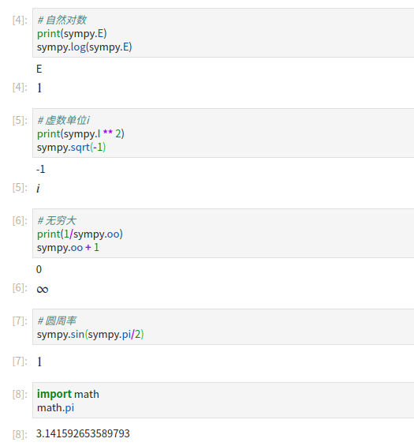
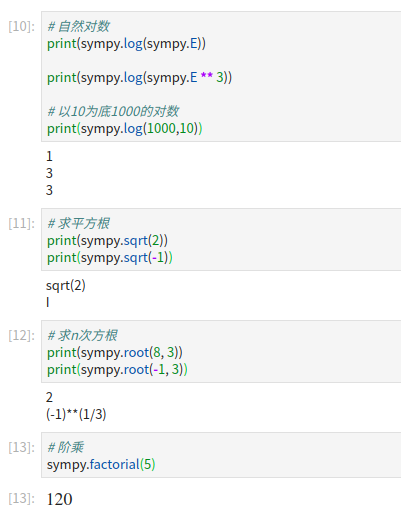

# 极限与连续

## 01 数列极限

设{xn}是一个数列，a是一个确定的数，若对任意给定的整数e，总存在一个自然数N，使得n>N时，都有`|xn-a|<e`，则称{xn}收敛于a。

收敛数列的性质

- 有界性
- 极限唯一性
- 保号性
- 保序性
- **夹逼法则**
- 四则运算

重要极限：

- `(1+1/n)**n`的极限是e

## 02 函数极限
数列是定义在自然数集N上的函数。

设函数y=f(x)在点x0的某个去心邻域内有定义，A是一个常数。如果对任意小的正数e，总存在一个正数b，使得当`0<|x-x0|<b`时，都有`|f(x)-A|<e`成立，当x趋向x0时，函数f以A为极限，或者f在x0的极限为A。

性质与运算：

- 唯一性
- 局部有界性
- 局部保号性
- 局部保序性
- 极限不等式
- **夹逼原理**
- 四则运算
- 复合运算

重要极限：

- `sinx/x`在x在0处的极限是1
- `(1+1/x)**x`的无穷大处的极限是e

## 03 连续函数

连续性: 设函数f在x0点的某个邻域内有定义，若f在x0处的极限是f(x0)，则称f在x0处连续。

闭区间上连续函数的性质

- 有界性
- 具有最大值和最小值
- 零点存在定理
- 介值定理

## 04 无穷小量与无穷大量的阶

为求乘积（或商）的极限，若某一因子（或分母中的某一因子）是无穷小，则可以把该因子用同阶的无穷小来替代。

当x趋向0时：

```
sinx ~ x
tanx ~ x
arcsinx ~ x
e**x -1 ~ x
ln(1+x) ~ x
1-cosx ~ x**2/2
sqrt(1+x) - 1 ~ x/2
```

同阶无穷大量也有类似的特征

## 05 Python做极限运算
这里介绍Python科学计算包sympy，安装很简单`pip install sympy`

主要运算：

- 表达式求值
- 解方程（组）
- 求和
- 求极限


### 05.01 数学中常用的常数
虚数单位i，自然对数的底e，无穷大oo与圆周率pi



### 05.02 初等运算



### 05.03 表达式与求值

```python
# 首先定义x为一个符号，表示一个变量
x = sympy.Symbol('x')

# 定义一个函数
fx = x**2+1
print(type(fx))

# 求值
fx.evalf(subs={x:2})

fx = (1+1/x)**x
fx.evalf(subs={x:10})
fx.evalf(subs={x:100})
fx.evalf(subs={x:1000})
fx.evalf(subs={x:10000})
```

多元表达式:

```python
# 首先定义x为一个符号，表示一个变量
x, y = sympy.symbols('x y')

# 定义一个函数
f_xy = x**2+x*y
print(type(fx))

# 求值
f_xy.evalf(subs={x:2, y:0.3})
```

### 05.04 用sympy解方程（组）

```python
x = sympy.Symbol('x')

# 解方程：x+1 = 0
print(sympy.solve(x+1, x))
# 解方程：x**2+1 = 0
f_x = x**2 + 1
print(sympy.solve(f_x, x))
```

方程组：

```python
x,y = sympy.symbols('x y')

f1 = x+y+3
f2 = 2*x-3*y-2
print(sympy.solve([f1, f2], [x,y]))
```

### 05.05 数列求和

```python
n = sympy.Symbol('n')

# 通项公式
an = n+1

# 计算前100项的和
print(sympy.summation(an, (n, 1, 100)))

an = 1/n
print(sympy.summation(an, (n, 1, 100)))

an = (1 + 1/n)**n
print(float(sympy.summation(an, (n, 1, 10))))
```

注意这里会输出一个很大的分子/分母格式的数据，如果想得到最后的结果：

```python
res = sympy.summation(an, (n, 1, 10))
sympy.Float(res, 3)
```

### 05.06 解带有求和式的方程

```python
x = sympy.Symbol('x')
i = sympy.Symbol('i', integer=True)
f = sympy.summation(x,(i,1,5)) + 10 * x - 15
sympy.solve(f,x)
```

### 05.07 极限

```python
x = sympy.Symbol('x')

# sin(x)/x在x=0处的极限
f1 = sympy.sin(x)/x
sympy.limit(f1, x, 0)

# 在无穷大处的极限
f2 = (1+1/x)**x
sympy.limit(f2, x, sympy.oo)
```


